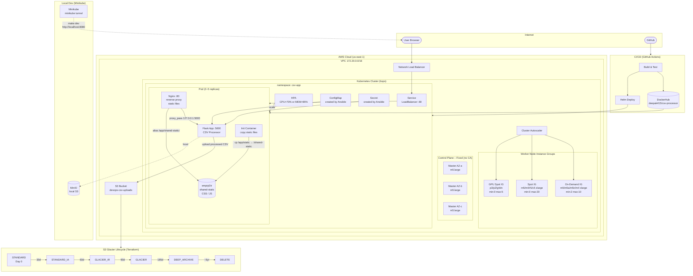

# DevOps Case Study — Architecture & Documentation

## Table of Contents
1. [Architecture Overview](#architecture-overview)
2. [Technology Stack](#technology-stack)
3. [Component Details](#component-details)
4. [Kubernetes Cluster (kops)](#kubernetes-cluster-kops)
5. [Application Infrastructure](#application-infrastructure)
6. [Web Application](#web-application)
7. [S3 Storage & Glacier Lifecycle](#s3-storage--glacier-lifecycle)
8. [CI/CD Pipeline](#cicd-pipeline)
9. [Local Development (Minikube)](#local-development-minikube)
10. [Repository Structure](#repository-structure)

---

## Architecture Overview

### System Diagram



### ASCII Overview

```
┌─────────────────────────────────────────────────────────────────────────────┐
│                         AWS Cloud Infrastructure                             │
│                                                                              │
│  ┌──────────────────────────────────────────────────────────────────────┐   │
│  │                    VPC (172.20.0.0/16)                               │   │
│  │                                                                       │   │
│  │  ┌─────────────────────────────────────────────────────────────┐    │   │
│  │  │              Kubernetes Cluster (kops)                       │    │   │
│  │  │                                                              │    │   │
│  │  │  ┌──────────────┐  ┌──────────────┐  ┌──────────────┐      │    │   │
│  │  │  │  Master AZ-A │  │  Master AZ-B │  │  Master AZ-C │      │    │   │
│  │  │  │  m5.large    │  │  m5.large    │  │  m5.large    │      │    │   │
│  │  │  │  (on-demand) │  │  (on-demand) │  │  (on-demand) │      │    │   │
│  │  │  └──────────────┘  └──────────────┘  └──────────────┘      │    │   │
│  │  │                                                              │    │   │
│  │  │  ┌──────────────────────────────────────────────────────┐   │    │   │
│  │  │  │         Worker Node Instance Groups                   │   │    │   │
│  │  │  │                                                        │   │    │   │
│  │  │  │  [On-Demand IG]  [Spot IG]        [GPU Spot IG]      │   │    │   │
│  │  │  │  m5.xlarge       m5/m4/r5/c5      p3/p2/g4dn        │   │    │   │
│  │  │  │  min:2 max:10    min:0 max:20     min:0 max:5        │   │    │   │
│  │  │  │                                                        │   │    │   │
│  │  │  │  ◄────── Cluster Autoscaler (per-IG) ──────────────► │   │    │   │
│  │  │  └──────────────────────────────────────────────────────┘   │    │   │
│  │  │                                                              │    │   │
│  │  │  ┌──────────────────────────────────────────────────────┐   │    │   │
│  │  │  │  namespace: csv-app                                   │   │    │   │
│  │  │  │                                                        │   │    │   │
│  │  │  │  ┌──────────────────────────────────────────────┐    │   │    │   │
│  │  │  │  │            Pod (2-20 replicas / HPA)          │    │   │    │   │
│  │  │  │  │                                               │    │   │    │   │
│  │  │  │  │  ┌─────────────┐    ┌──────────────────────┐ │    │   │    │   │
│  │  │  │  │  │  Nginx      │    │  Flask App           │ │    │   │    │   │
│  │  │  │  │  │  :80        │───►│  :5000               │ │    │   │    │   │
│  │  │  │  │  │  (sidecar)  │    │  (CSV Processor)     │ │    │   │    │   │
│  │  │  │  │  └─────────────┘    └──────────────────────┘ │    │   │    │   │
│  │  │  │  │         │                    │                 │    │   │    │   │
│  │  │  │  │  ┌──────▼──────────────────▼────────────┐    │    │   │    │   │
│  │  │  │  │  │  emptyDir (shared-static)              │    │    │   │    │   │
│  │  │  │  │  │  CSS/JS files served by Nginx          │    │    │   │    │   │
│  │  │  │  │  └────────────────────────────────────────┘    │    │   │    │   │
│  │  │  │  └──────────────────────────────────────────────┘    │   │    │   │
│  │  │  │                                                        │   │    │   │
│  │  │  │  HPA: CPU>70% or MEM>85% → scale up                  │   │    │   │
│  │  │  └──────────────────────────────────────────────────────┘   │    │   │
│  │  └──────────────────────────────────────────────────────────────┘    │   │
│  │                                                                       │   │
│  │  ┌─────────────────────────────────────────────────────────────┐    │   │
│  │  │                AWS S3 Bucket                                 │    │   │
│  │  │                                                              │    │   │
│  │  │  processed/ ──30d──► STANDARD_IA ──90d──► GLACIER_IR       │    │   │
│  │  │                                   ──180d─► GLACIER          │    │   │
│  │  │                                   ──365d─► DEEP_ARCHIVE     │    │   │
│  │  │                                   ──2555d─► DELETE          │    │   │
│  │  └──────────────────────────────────────────────────────────────┘    │   │
│  └──────────────────────────────────────────────────────────────────────┘   │
└─────────────────────────────────────────────────────────────────────────────┘

External Traffic Flow:
  User → NLB (LoadBalancer Service) → Nginx:80 → Flask:5000 → S3

CI/CD Flow:
  Git Push → GitHub Actions → Docker Build → DockerHub
           → Helm Deploy → Kubernetes → Rolling Update
```

---

## Technology Stack

| Layer | Technology | Rationale |
|-------|-----------|-----------|
| **Web App** | Python 3.12 + Flask | Lightweight, fast CSV processing |
| **Web Server** | Nginx 1.25 | High-performance reverse proxy & static files |
| **Container** | Docker + Gunicorn | Production WSGI server |
| **Orchestration** | Kubernetes (kops) | Full cluster control on AWS |
| **Cluster Provisioning** | kops | Declarative K8s cluster on AWS |
| **Autoscaling (nodes)** | Cluster Autoscaler | Scale IGs based on pending pods |
| **Autoscaling (pods)** | HPA (autoscaling/v2) | Scale on CPU + Memory metrics |
| **Package Manager** | Helm 3 | Reusable K8s templates per env |
| **Config Management** | Ansible | Application & Nginx configuration |
| **Infrastructure** | Terraform | S3 bucket + IAM + lifecycle rules |
| **Storage (archive)** | AWS S3 + Glacier | Lifecycle-managed CSV archiving |
| **CI/CD** | GitHub Actions | Automated test → build → deploy |
| **Registry** | DockerHub | Public Docker image storage |
| **Networking** | Calico CNI | Network policy support |
| **Local Dev** | Minikube + docker-compose | Fast local iteration |

---

## Component Details

### Pod Architecture (Sidecar Pattern)

```
┌─────────────────────────── Pod ────────────────────────────────┐
│                                                                  │
│  Init Container (static-files-init)                             │
│  └── Copies /app/static/* → emptyDir volume (once at start)    │
│                                                                  │
│  Container 1: nginx:1.25-alpine                                 │
│  ├── Listens on :80                                             │
│  ├── Proxies / → flask-app:5000                                 │
│  └── Serves /static/ from emptyDir (fast, no NFS)              │
│                                                                  │
│  Container 2: csv-processor:latest (Flask/Gunicorn)             │
│  ├── Listens on :5000                                           │
│  ├── POST /upload → parse CSV → upload S3 → store metadata     │
│  └── GET / → list processed files                               │
│                                                                  │
│  Shared Volumes (emptyDir - NOT NFS):                           │
│  ├── shared-static: CSS/JS files (init→nginx)                   │
│  ├── uploads-storage: raw CSV uploads                           │
│  └── processed-storage: metadata.json                           │
└──────────────────────────────────────────────────────────────────┘
```

---

## Kubernetes Cluster (kops)

### Instance Groups

| IG Name | Type | Instance Types | Min | Max | Lifecycle |
|---------|------|---------------|-----|-----|-----------|
| master-us-east-1a/b/c | Master | m5.large | 1 | 1 | On-Demand |
| nodes-ondemand | Node | m5.xlarge, m5a, m5n, m4 | 2 | 10 | On-Demand |
| nodes-spot | Node | m5/m4/r5/c5.xlarge | 0 | 20 | Spot (max $0.10/hr) |
| nodes-gpu-spot | Node | p3.2xl, p2.xl, g4dn.xl | 0 | 5 | Spot |

### Cluster Autoscaler
- Uses ASG tag-based auto-discovery
- Expander: `least-waste` (picks IG that wastes fewest resources)
- Scale-down delay: 10 minutes of inactivity
- Skips system pods nodes during scale-down

### Spot Instance Strategy
- Spot IG: `PreferNoSchedule` taint → only scheduled if no on-demand capacity
- Multiple instance families in mixed policy for better spot availability
- GPU IG: `NoSchedule` taint → requires explicit toleration

---

## Application Infrastructure

### HPA Configuration
```yaml
metrics:
  - CPU: scale out at 70% utilization
  - Memory: scale out at 85% utilization
scaleUp:
  stabilization: 60s (react quickly to load)
scaleDown:
  stabilization: 300s (avoid flapping)
```

### Service Exposure
- **External**: `LoadBalancer` (AWS NLB) on port 80
- **Internal**: `ClusterIP` for pod-to-pod communication
- **PDB**: minimum 1 pod available during disruptions

---

## Web Application

### CSV Processing Flow
```
User uploads CSV
     │
     ▼
Flask receives file (POST /upload)
     │
     ▼
werkzeug secure_filename + timestamp prefix
     │
     ▼
Save to /app/uploads/
     │
     ▼
Parse CSV (csv.reader, strip quotes/spaces)
     │
     ▼
Upload to S3 bucket (processed/YYYY/MM/DD/filename)
     │
     ▼
Save metadata to /app/processed/metadata.json
     │
     ▼
Render result table in browser (all rows displayed)
     │
     ▼
GET / → show metadata.json history
```

### Static Files Architecture (emptyDir pattern)
The init container pattern avoids NFS:
1. Init container copies static files from app image → `emptyDir` volume
2. Nginx reads static files from `emptyDir` (in-memory, same node)
3. Flask app serves dynamic content only
4. Result: Nginx serves CSS/JS with 30-day cache headers, zero NFS dependency

---

## S3 Storage & Glacier Lifecycle

### Storage Classes Timeline

```
Day 0    → Upload (STANDARD)
Day 30   → Transition to STANDARD_IA     (40% cheaper)
Day 90   → Transition to GLACIER_IR      (68% cheaper, ms retrieval)
Day 180  → Transition to GLACIER         (80% cheaper, hrs retrieval)
Day 365  → Transition to DEEP_ARCHIVE    (95% cheaper, 12hr retrieval)
Day 2555 → DELETE (7 year compliance window)
```

### S3 Security
- Bucket: private, no public ACLs
- Encryption: AES256 (SSE-S3) with bucket key
- Versioning: enabled (for accidental delete protection)
- IAM: least-privilege role (PutObject, GetObject, ListBucket only)

---

## CI/CD Pipeline

```
git push main
     │
     ▼
GitHub Actions
     ├── test: pytest + flake8
     ├── build: docker build + push to DockerHub (SHA tag)
     ├── helm-validate: helm lint + template dry-run (dev + prod)
     ├── terraform: validate + plan (S3 config)
     └── deploy-prod: helm upgrade --install (with rollback on failure)
```

---

## Local Development (Minikube)

```bash
# Start Minikube
minikube start --cpus=4 --memory=8192

# Build app image
docker build -t csv-processor:local ./app

# Load into Minikube
minikube image load csv-processor:local

# Deploy with Helm (dev values)
helm upgrade --install csv-app helm/csv-app \
  -f helm/environments/dev-values.yaml \
  --set image.flaskApp.repository=csv-processor \
  --set image.flaskApp.tag=local \
  --namespace csv-app --create-namespace

# Access app
minikube service csv-app-service -n csv-app

# OR use docker-compose for quickest iteration
docker-compose up --build
# → http://localhost:8080
```

---

## Repository Structure

```
.
├── app/                          # Web application
│   ├── app.py                    # Flask application (CSV parser + S3)
│   ├── Dockerfile                # Multi-stage Docker build
│   ├── nginx.conf                # Nginx config (reverse proxy + static)
│   ├── requirements.txt          # Python dependencies
│   ├── templates/
│   │   ├── index.html            # Upload form + processed files list
│   │   └── result.html           # CSV display table
│   └── static/
│       ├── css/main.css          # Responsive styles
│       └── js/main.js            # Drag-drop upload UX
│
├── k8s-kops/                     # Kubernetes & kops manifests
│   ├── cluster.yaml              # kops Cluster definition
│   ├── instancegroups.yaml       # Multi-IG: masters + on-demand + spot + GPU
│   ├── cluster-autoscaler.yaml   # Cluster Autoscaler deployment
│   ├── deployment.yaml           # App Deployment (nginx+flask sidecar)
│   └── service-hpa.yaml          # Service + HPA + PDB
│
├── helm/                         # Helm chart for multi-environment deploy
│   ├── csv-app/
│   │   ├── Chart.yaml
│   │   ├── values.yaml           # Default values
│   │   └── templates/
│   │       ├── deployment.yaml
│   │       ├── service.yaml
│   │       ├── hpa.yaml
│   │       ├── configmap.yaml
│   │       ├── pdb.yaml
│   │       └── namespace.yaml
│   └── environments/
│       ├── dev-values.yaml       # Dev overrides (1 replica, NodePort)
│       └── prod-values.yaml      # Prod overrides (4+ replicas, NLB)
│
├── ansible/                      # Configuration management
│   ├── site.yaml                 # Main playbook
│   ├── inventory/hosts.ini       # Inventory (masters + workers)
│   ├── group_vars/all.yaml       # Global vars (app config, AWS, etc.)
│   └── roles/
│       ├── app-config/           # Flask/gunicorn systemd setup
│       └── nginx-config/         # Nginx install + vhost config
│
├── terraform-s3/                 # S3 infrastructure
│   ├── main.tf                   # Bucket + lifecycle + IAM
│   ├── variables.tf
│   └── outputs.tf
│
├── .github/workflows/
│   └── ci-cd.yaml                # GitHub Actions: test→build→deploy
│
├── docker-compose.yml            # Local development stack
└── ARCHITECTURE.md               # This document
```

---

## Recommended Tools Summary

| Category | Tool | Version |
|----------|------|---------|
| K8s Provisioning | kops | 1.29+ |
| K8s Package Manager | Helm | 3.14+ |
| Config Management | Ansible | 2.16+ |
| Infrastructure as Code | Terraform | 1.7+ |
| Container Runtime | Docker | 25+ |
| Local K8s | Minikube | 1.32+ |
| CI/CD | GitHub Actions | - |
| Monitoring | Prometheus + Grafana | 2.50+ |
| Ingress | AWS NLB + Nginx Ingress | - |
| Secret Management | AWS Secrets Manager / Vault | - |
| Image Registry | DockerHub | - |
