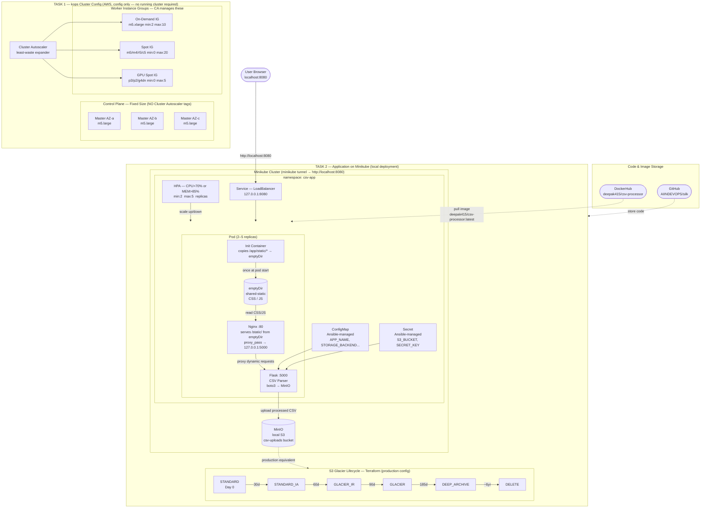

# DevOps Case Study — Architecture

## Table of Contents
1. [System Diagram](#system-diagram)
2. [Task 1 — Kubernetes Cluster Config (kops)](#task-1--kubernetes-cluster-config-kops)
3. [Task 2 — Application on Minikube](#task-2--application-on-minikube)
4. [Pod Architecture (Sidecar + emptyDir)](#pod-architecture-sidecar--emptydir)
5. [HPA Autoscaling](#hpa-autoscaling)
6. [Ansible Configuration Management](#ansible-configuration-management)
7. [S3 Glacier Lifecycle (Terraform)](#s3-glacier-lifecycle-terraform)
8. [Repository Structure](#repository-structure)

---

## System Diagram



---

## Task 1 — Kubernetes Cluster Config (kops)

> *A running cluster is not expected — this is the configuration deliverable.*

**Location:** `k8s-kops/`

### Instance Groups

| Instance Group | Role | Instance Types | Min | Max | Lifecycle |
|---|---|---|---|---|---|
| master-us-east-1a | Control Plane | m5.large | 1 | 1 | On-Demand — fixed, no CA |
| master-us-east-1b | Control Plane | m5.large | 1 | 1 | On-Demand — fixed, no CA |
| master-us-east-1c | Control Plane | m5.large | 1 | 1 | On-Demand — fixed, no CA |
| nodes-ondemand | Workers | m5/m5a/m5n/m4.xlarge | 2 | 10 | On-Demand |
| nodes-spot | Workers | m5/m4/r5/c5.xlarge | 0 | 20 | Spot (max $0.10/hr) |
| nodes-gpu-spot | Workers | p3.2xl, p2.xl, g4dn.xl | 0 | 5 | Spot |

### Cluster Autoscaler (`k8s-kops/cluster-autoscaler.yaml`)
- Auto-discovers worker IGs via ASG tags (`k8s.io/cluster-autoscaler/enabled`)
- Expander: `least-waste` — picks IG that wastes fewest CPU/memory
- Scale-down after 10 minutes of node inactivity
- **Masters have NO CA tags** — scaling masters breaks etcd quorum

---

## Task 2 — Application on Minikube

```
User opens http://localhost:8080
        │
        ▼
LoadBalancer Service  (127.0.0.1:8080 via minikube tunnel)
        │
        ▼
Nginx :80  in Pod
  ├── GET /static/*  → served from emptyDir (init container copied CSS/JS here)
  └── All other requests → proxy_pass http://127.0.0.1:5000
        │
        ▼
Flask :5000  in same Pod
  ├── POST /upload   → parse CSV → upload to MinIO → save metadata.json
  ├── GET  /         → read metadata.json → list previously processed files
  ├── GET  /health   → {"status":"healthy","storage_backend":"minio"}
  └── GET  /ready    → readiness probe
        │
        ▼
MinIO (local S3)  →  csv-uploads/processed/YYYY/MM/DD/<timestamp>_filename.csv
```

---

## Pod Architecture (Sidecar + emptyDir)

```
┌──────────────────────────── Pod ─────────────────────────────────────┐
│                                                                        │
│  Init Container: static-files-init  (runs ONCE at pod start)         │
│  └── cp /app/static/* → /app/shared-static/  (emptyDir volume)       │
│                                                                        │
│  Container 1: nginx:1.25-alpine                                       │
│  ├── listens :80                                                       │
│  ├── location /static/ { alias /app/shared-static/; }  ← emptyDir    │
│  └── location / { proxy_pass http://127.0.0.1:5000; }  ← Flask       │
│                                                                        │
│  Container 2: deepak415/csv-processor:latest  (Flask + Gunicorn)     │
│  ├── listens :5000                                                     │
│  ├── POST /upload  → parse CSV → boto3 upload → metadata.json         │
│  └── GET  /        → read metadata.json → render HTML table           │
│                                                                        │
│  Shared Volumes  (emptyDir — NOT NFS):                                │
│  ├── shared-static:      CSS/JS  (init → nginx)                       │
│  ├── uploads-storage:    raw uploaded CSVs                             │
│  └── processed-storage:  metadata.json                                │
└────────────────────────────────────────────────────────────────────────┘
```

**Why emptyDir and not NFS:**
The init container copies static files from the app image into an `emptyDir` volume
at pod start. Nginx reads from that volume directly — it is in-memory, on the same node,
and has zero external dependencies. This satisfies the assignment requirement of
*"sharing public files through shared storage (not nfs)"*.

---

## HPA Autoscaling

```yaml
minReplicas: 2
maxReplicas: 5
metrics:
  - CPU:    averageUtilization: 70    # scale up above 70%
  - Memory: averageUtilization: 85   # scale up above 85%
behavior:
  scaleUp:   stabilizationWindowSeconds: 60   # react quickly
  scaleDown: stabilizationWindowSeconds: 300  # avoid flapping
```

**Memory utilisation note:** calculated as `actual usage / memory REQUEST`.
Flask container request = 256Mi. Actual idle usage ≈ 195Mi → 76% → safely below 85%.

---

## Ansible Configuration Management

`ansible/site.yaml` — uses `kubernetes.core` collection, no SSH into nodes:

```yaml
tasks:
  - ConfigMap:   APP_NAME, STORAGE_BACKEND, AWS_REGION, S3_BUCKET, S3_PREFIX
  - Secret:      S3_BUCKET, SECRET_KEY
  - Patch:       Deployment → reference ConfigMap + Secret
  - Wait:        kubernetes.core.k8s_rollout_status
  - Health check: kubernetes.core.k8s_exec → GET /health
```

```bash
ansible-galaxy collection install -r ansible/requirements.yml
ansible-playbook ansible/site.yaml -i ansible/inventory/k8s.yaml
```

---

## S3 Glacier Lifecycle (Terraform)

**Location:** `terraform-s3/main.tf`

Assignment requirement: *"Waiting you to implement s3 glacier transition on s3 config."*

```
processed/ prefix lifecycle:

Day 0    STANDARD       → full performance, instant access
Day 30   STANDARD_IA    → 40% cheaper, infrequent access
Day 90   GLACIER_IR     → 68% cheaper, millisecond retrieval
Day 180  GLACIER        → 80% cheaper, 3-5 hour retrieval
Day 365  DEEP_ARCHIVE   → 95% cheaper, 12 hour retrieval
Day 2555 DELETE         → 7-year compliance window
```

```bash
cd terraform-s3
terraform init
terraform plan
terraform apply
```

---

## Repository Structure

```
.
├── deploy.sh                     One-command local deploy
├── Makefile                      Individual make targets
│
├── app/                          Web application
│   ├── app.py                    Flask: CSV parse, MinIO upload, metadata
│   ├── Dockerfile                python:3.12-slim, non-root uid 1001
│   ├── nginx.conf                Reverse proxy + emptyDir static serving
│   ├── requirements.txt
│   ├── templates/
│   │   ├── index.html            Upload form + previously processed files
│   │   └── result.html           Full CSV table (751 rows)
│   └── static/css/ + js/
│
├── k8s-kops/                     TASK 1 — kops cluster config (no running cluster needed)
│   ├── cluster.yaml              Cluster: VPC 172.20.0.0/16, Calico CNI
│   ├── instancegroups.yaml       3 masters (fixed) + 3 worker IGs
│   ├── cluster-autoscaler.yaml   CA for worker IGs (least-waste)
│   ├── deployment.yaml           App deployment (nginx+flask, emptyDir)
│   └── service-hpa.yaml          LoadBalancer + HPA + PDB
│
├── helm/                         TASK 2 — Helm packaging
│   ├── csv-app/                  Reusable chart
│   └── environments/
│       ├── local-values.yaml     Minikube: LoadBalancer :8080, MinIO, 256Mi
│       ├── dev-values.yaml       Dev cluster overrides
│       └── prod-values.yaml      Production overrides
│
├── ansible/                      TASK 2 — Config management (kubernetes.core)
│   ├── site.yaml
│   ├── requirements.yml
│   ├── inventory/k8s.yaml
│   └── group_vars/all.yaml
│
├── terraform-s3/                 TASK 2 — S3 Glacier lifecycle
│   ├── main.tf                   Bucket + glacier transition rules + IAM
│   ├── variables.tf
│   └── outputs.tf
│
├── local/                        Local Minikube helpers
│   ├── k8s/                      namespace, minio, minio-init-job
│   ├── ansible/                  Local Ansible playbook
│   └── scripts/smoke-test.sh
│
├── screenshots/                  All captured screenshots + architecture diagram
├── docker-compose.yml            Quick local start without Minikube
├── README.md                     Project overview + quick-start
└── LOCAL-TESTING-GUIDE.md        Detailed Minikube walkthrough with screenshots
```

---

## Technology Stack

| Layer | Technology | Purpose |
|-------|-----------|---------|
| Web Framework | Python 3.12 + Flask | CSV parsing, HTML rendering |
| Web Server | Nginx 1.25-alpine | Reverse proxy + static files via emptyDir |
| WSGI Server | Gunicorn | Production multi-worker server |
| Container | Docker — `deepak415/csv-processor` | Immutable image on DockerHub |
| Cluster Config | kops 1.29+ | Declarative K8s cluster definition (Task 1) |
| Local Cluster | Minikube (docker driver) | Local deployment on Mac (Task 2) |
| Node Autoscaling | Cluster Autoscaler | Scales worker IGs on pending pods |
| Pod Autoscaling | HPA v2 | CPU + Memory metric-based scaling |
| Helm | Helm 3.14+ | Multi-environment K8s packaging |
| Config Management | Ansible + kubernetes.core | ConfigMap/Secret via K8s API |
| IaC | Terraform 1.7+ | S3 bucket + Glacier lifecycle + IAM |
| Local Storage | MinIO | S3-compatible local object store |
| Cloud Storage | AWS S3 + Glacier | Production CSV storage (Terraform) |
| Image Registry | DockerHub | `deepak415/csv-processor:latest` |
| Code Storage | GitHub | `github.com/AIINDEVOPS/silk` |
| CNI | Calico | NetworkPolicy support on kops |
