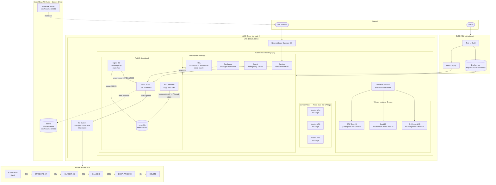
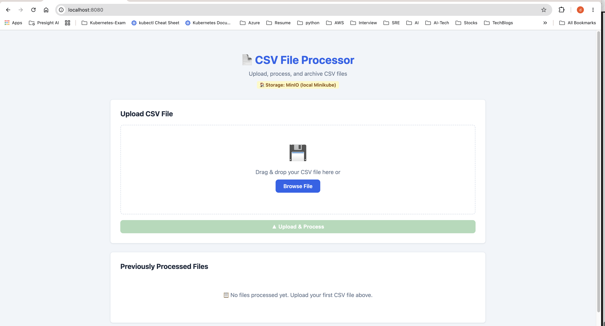
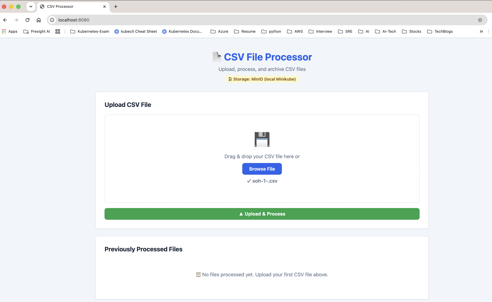
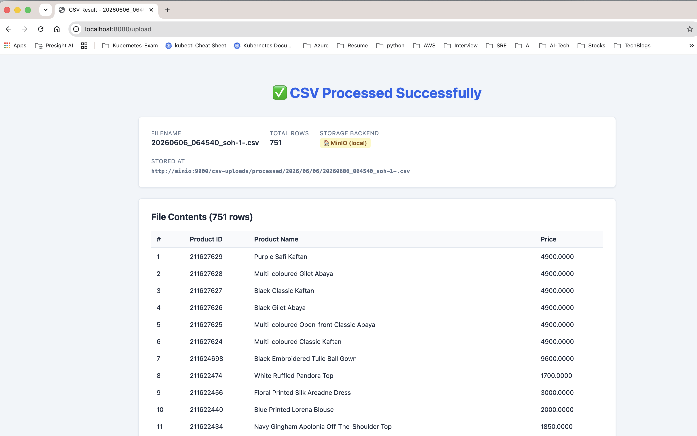
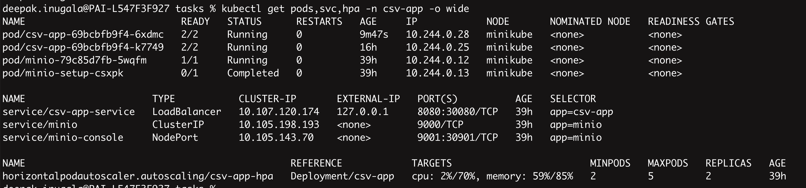
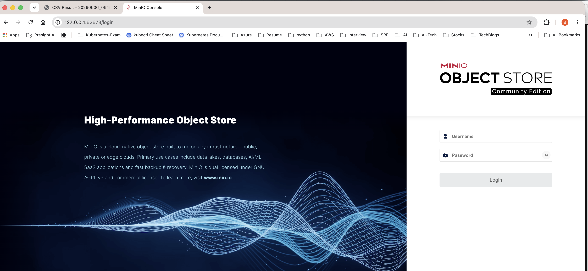
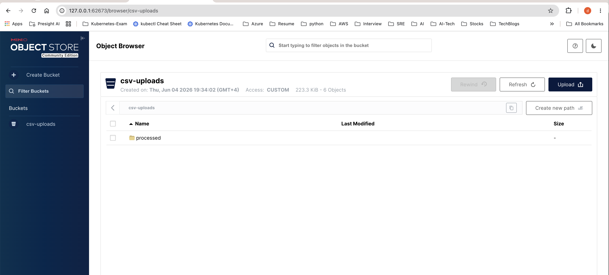
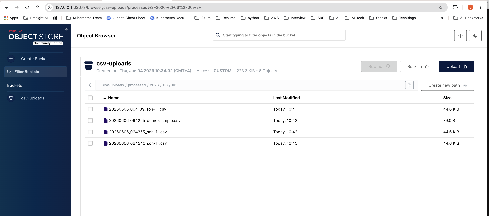
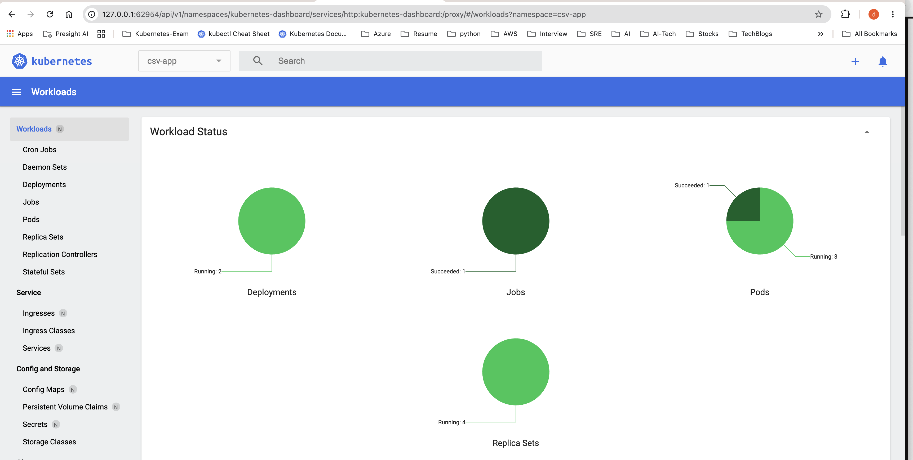

# DevOps Case Study — CSV Processor on Kubernetes

A production-grade DevOps implementation demonstrating Kubernetes cluster management,
containerised application deployment, CI/CD automation, infrastructure as code, and
configuration management — all running end-to-end on Minikube locally and designed
for AWS/Azure in production.

---

## Table of Contents

1. [Assignment Overview](#assignment-overview)
2. [Architecture](#architecture)
3. [Quick Start (Local — Minikube)](#quick-start-local--minikube)
4. [Screenshots](#screenshots)
5. [Component Breakdown](#component-breakdown)
   - [Kubernetes Cluster (kops)](#1-kubernetes-cluster-kops)
   - [Application — Nginx + Flask Sidecar Pod](#2-application--nginx--flask-sidecar-pod)
   - [Helm Multi-Environment Packaging](#3-helm-multi-environment-packaging)
   - [HPA Autoscaling](#4-hpa-autoscaling)
   - [Ansible Configuration Management](#5-ansible-configuration-management)
   - [S3 Storage + Glacier Lifecycle (Terraform)](#6-s3-storage--glacier-lifecycle-terraform)
   - [CI/CD Pipeline (GitHub Actions)](#7-cicd-pipeline-github-actions)
   - [Azure AKS](#8-azure-aks)
6. [Repository Structure](#repository-structure)
7. [Detailed Guides](#detailed-guides)

---

## Assignment Overview

| Requirement | Implementation | Location |
|-------------|---------------|----------|
| kops K8s cluster (multi-AZ, spot+on-demand) | 3 masters + 3 worker IGs, Cluster Autoscaler | `k8s-kops/` |
| Nginx + Flask in same pod (emptyDir, not NFS) | Init container copies static → emptyDir → Nginx | `app/`, `helm/`, `k8s-kops/` |
| Service object | LoadBalancer (prod) / LoadBalancer+tunnel (local) | `helm/csv-app/templates/service.yaml` |
| HPA autoscaling | CPU >70% or Memory >85% → 2–5 replicas | `helm/csv-app/templates/hpa.yaml` |
| Ansible config management | K8s-native: ConfigMap + Secret via `kubernetes.core` | `ansible/` |
| Helm multi-environment | local / dev / prod values files | `helm/environments/` |
| Python CSV app + browser display | Flask, 751 rows rendered as HTML table | `app/app.py` |
| Upload UI + previously processed list | Drag-drop upload, metadata.json history | `app/templates/` |
| S3 upload after processing | boto3 → MinIO (local) or AWS S3 (prod) | `app/app.py` |
| S3 Glacier lifecycle (Terraform) | 30d→IA, 90d→GLACIER_IR, 365d→DEEP_ARCHIVE | `terraform-s3/` |
| CI/CD pipeline | GitHub Actions: test → build → push → helm deploy | `.github/workflows/ci-cd.yaml` |
| Docker image on registry | `deepak415/csv-processor:latest` on DockerHub | `app/Dockerfile` |
| Azure AKS | Full Azure deployment config | `azure/` |

---

## Architecture

### System Diagram



### Traffic Flow

```
Browser → LoadBalancer :80 → Nginx :80 → proxy_pass 127.0.0.1:5000 → Flask :5000
                                       → /static/* served from emptyDir (no NFS)
Flask → S3/MinIO (boto3) → stored at processed/YYYY/MM/DD/<filename>
```

---

## Quick Start (Local — Minikube)

### Prerequisites

```bash
# macOS
brew install minikube kubectl helm ansible
brew install --cask docker      # Docker Desktop
```

### 1. Clone and start

```bash
git clone https://github.com/AIINDEVOPS/silk.git
cd silk

# Start Minikube with required addons
minikube start --driver=docker --cpus=4 --memory=8192
minikube addons enable metrics-server
```

### 2. Deploy everything

```bash
# Deploy MinIO (local S3), app via Helm, run Ansible validation
make dev
```

Or step by step:

```bash
make deploy-minio    # MinIO + bucket setup
make deploy-helm     # Helm install csv-app with local-values.yaml
make ansible-validate
```

### 3. Start tunnel and open app

In a **separate terminal** (keep it open):
```bash
minikube tunnel
```

Then open:
```bash
make open        # http://localhost:8080
make open-minio  # MinIO console  (login: minioadmin / minioadmin)
```

### 4. Upload the sample CSV

1. Go to `http://localhost:8080`
2. Drag and drop `tasks/soh-1-.csv` (751 rows of fashion products)
3. Click **Upload & Process**
4. The full table renders in the browser
5. The file is stored in MinIO at `csv-uploads/processed/YYYY/MM/DD/`

### 5. Verify Kubernetes resources

```bash
kubectl get pods,svc,hpa -n csv-app
# NAME                      READY   STATUS    RESTARTS
# pod/csv-app-xxx-yyy       2/2     Running   0        ← 2 containers: nginx + flask
# pod/minio-xxx-aaa         1/1     Running   0
#
# NAME                    TYPE           CLUSTER-IP      EXTERNAL-IP   PORT(S)
# service/csv-app-service LoadBalancer   10.96.x.x       127.0.0.1     8080:xxxxx/TCP
# service/minio-console   NodePort       10.96.x.x       <none>        9001:30901/TCP
#
# NAME                                     REFERENCE           TARGETS
# horizontalpodautoscaler.autoscaling/...  Deployment/csv-app  cpu:2%/70%  mem:60%/85%
```

---

## Screenshots

### 1. Application — Upload form (`http://localhost:8080`)

> CSV File Processor running on Minikube via `minikube tunnel`. Storage backend shows
> **MinIO (local Minikube)** — the S3-compatible local object store.



---

### 2. File selected — ready to process

> `soh-1-.csv` (751 fashion products) selected via drag-drop. Clicking **Upload & Process**
> sends the file to Flask, parses every row, uploads to MinIO, and renders the result table.



---

### 3. CSV processed — 751 rows displayed

> Flask parsed all 751 rows (Product ID, Name, Price) and stored the file at
> `minio:9000/csv-uploads/processed/2026/06/06/20260606_064540_soh-1-.csv`.
> Storage backend, total rows, and full MinIO path are shown on the result page.



---

### 4. Kubernetes pods, services, and HPA

> `kubectl get pods,svc,hpa -n csv-app -o wide` shows:
> - **2/2 Running** pods (Nginx sidecar + Flask in same pod)
> - **LoadBalancer** service with EXTERNAL-IP `127.0.0.1:8080` (via `minikube tunnel`)
> - **HPA**: CPU `2%/70%`, Memory `59%/85%` — both well below thresholds → 2 replicas idle



---

### 5. MinIO login page

> MinIO Object Store console running inside the Minikube cluster, accessible via
> `minikube service minio-console -n csv-app`. Credentials: `minioadmin / minioadmin`.



---

### 6. MinIO bucket browser — `csv-uploads`

> The `csv-uploads` bucket was created by the init job (`minio-init-job.yaml`).
> All processed CSVs land under the `processed/` prefix, mirroring the S3 layout
> used in production (managed by the Terraform lifecycle policy).



---

### 7. MinIO processed files — `processed/2026/06/06/`

> Four uploaded CSVs stored under the `YYYY/MM/DD` date-partitioned path:
> - `20260606_064139_soh-1-.csv` — first upload
> - `20260606_064255_demo-sample.csv` — demo 3-row sample
> - `20260606_064255_soh-1-.csv` — second upload
> - `20260606_064540_soh-1-.csv` — third upload (shown in result screenshot above)



---

### 8. Minikube dashboard — Workload Status

> Kubernetes dashboard filtered to `csv-app` namespace shows:
> - **2 Deployments** running (`csv-app` + `minio`)
> - **3 Pods** running (2 app pods `2/2` + 1 MinIO pod)
> - **4 Replica Sets** (current + previous rollout history)
> - **1 Job** completed (MinIO bucket init job)



---

## Component Breakdown

### 1. Kubernetes Cluster (kops)

**Location:** `k8s-kops/`

A production-ready, multi-AZ kops cluster across `us-east-1a/b/c`:

| Instance Group | Role | Instance Types | Min | Max | Lifecycle |
|---------------|------|---------------|-----|-----|-----------|
| master-us-east-1a/b/c | Control plane | m5.large | 1 | 1 | On-Demand (fixed — etcd quorum) |
| nodes-ondemand | Workers | m5/m5a/m5n/m4.xlarge | 2 | 10 | On-Demand |
| nodes-spot | Workers | m5/m4/r5/c5.xlarge | 0 | 20 | Spot (max $0.10/hr) |
| nodes-gpu-spot | Workers | p3.2xl, p2.xl, g4dn.xl | 0 | 5 | Spot |

**Cluster Autoscaler** (`k8s-kops/cluster-autoscaler.yaml`):
- Auto-discovers worker IGs via ASG tags (`k8s.io/cluster-autoscaler/enabled`)
- Expander: `least-waste` — picks the IG that wastes fewest resources
- Masters deliberately have NO CA tags — scaling masters would break etcd quorum
- Scale-down after 10 min of node inactivity

**Network:**
- VPC CIDR: `172.20.0.0/16`
- Pod CIDR: `100.96.0.0/11`
- Service CIDR: `100.64.0.0/13`
- CNI: Calico (supports NetworkPolicy)

---

### 2. Application — Nginx + Flask Sidecar Pod

**Location:** `app/`, `k8s-kops/deployment.yaml`, `helm/csv-app/`

The pod runs **two containers sharing volumes** — no NFS required:

```
Pod
├── Init Container (static-files-init)
│   └── Copies /app/static/* → emptyDir volume (runs once at pod start)
│
├── Container: nginx:1.25-alpine
│   ├── Listens :80
│   ├── proxy_pass http://127.0.0.1:5000  (Flask)
│   └── Serves /static/* from emptyDir (30-day cache headers)
│
└── Container: deepak415/csv-processor:latest (Flask + Gunicorn)
    ├── Listens :5000
    ├── POST /upload → parse CSV → upload S3/MinIO → store metadata.json
    └── GET /        → read metadata.json → render processed files list
```

**Why emptyDir and not NFS:**
The init container copies static files from the app image into an `emptyDir` volume at pod start. Both Nginx and Flask mount the same emptyDir. This is faster, simpler, and has zero external dependencies.

**Docker image:** `deepak415/csv-processor:latest` — [`Dockerfile`](app/Dockerfile)

---

### 3. Helm Multi-Environment Packaging

**Location:** `helm/`

```
helm/
├── csv-app/             # Reusable chart
│   ├── Chart.yaml
│   ├── values.yaml      # Defaults
│   └── templates/
│       ├── deployment.yaml   # replicas wrapped: only set if HPA disabled
│       ├── service.yaml
│       ├── hpa.yaml
│       ├── configmap.yaml
│       ├── pdb.yaml
│       └── namespace.yaml
└── environments/
    ├── local-values.yaml    # Minikube: LoadBalancer :8080, MinIO, 256Mi request
    ├── dev-values.yaml      # Dev cluster: NodePort, S3, 1 replica
    └── prod-values.yaml     # Prod: LoadBalancer :80, S3, 4 replicas, strict HPA
```

Deploy to any environment:
```bash
helm upgrade --install csv-app helm/csv-app -f helm/environments/local-values.yaml -n csv-app --create-namespace
helm upgrade --install csv-app helm/csv-app -f helm/environments/prod-values.yaml  -n csv-app --create-namespace
```

---

### 4. HPA Autoscaling

**Location:** `helm/csv-app/templates/hpa.yaml`

```yaml
metrics:
  - CPU:    target 70%   utilization
  - Memory: target 85%   utilization
minReplicas: 2
maxReplicas: 5
scaleUp:   stabilizationWindowSeconds: 60    # react quickly to load
scaleDown: stabilizationWindowSeconds: 300   # avoid flapping
```

**Key detail:** memory utilization is calculated as `actual usage / memory REQUEST` (not limit).
The Flask container request is set to `256Mi` (actual idle ~195Mi → ~76% at rest, well below 85%).

The `spec.replicas` field in the Deployment template is **conditionally omitted** when HPA is enabled,
preventing a Helm Server-Side Apply conflict with `kube-controller-manager`:

```yaml
{{- if not .Values.autoscaling.enabled }}
replicas: {{ .Values.replicaCount }}
{{- end }}
```

---

### 5. Ansible Configuration Management

**Location:** `ansible/`

Uses `kubernetes.core` collection — no SSH into nodes, pure K8s API:

```yaml
# ansible/site.yaml
- name: Manage Kubernetes application configuration
  hosts: localhost
  connection: local
  tasks:
    - name: Apply app ConfigMap (non-sensitive config via Ansible)
      kubernetes.core.k8s:
        state: present
        definition:
          kind: ConfigMap
          data:
            APP_NAME: "{{ app_name }}"
            STORAGE_BACKEND: "{{ storage_backend }}"
            AWS_REGION: "{{ aws_region }}"
            ...

    - name: Apply app Secret
      kubernetes.core.k8s:
        definition:
          kind: Secret
          stringData:
            S3_BUCKET: "{{ s3_bucket }}"
            SECRET_KEY: "{{ vault_secret_key }}"

    - name: Patch Deployment to reference Ansible-managed ConfigMap
      kubernetes.core.k8s:
        state: patched
        kind: Deployment
        name: csv-app

    - name: Wait for deployment rollout
      kubernetes.core.k8s_rollout_status: ...

    - name: Check Flask health endpoint
      kubernetes.core.k8s_exec: ...
```

Install collections and run:
```bash
ansible-galaxy collection install -r ansible/requirements.yml
ansible-playbook ansible/site.yaml -i ansible/inventory/k8s.yaml
```

---

### 6. S3 Storage + Glacier Lifecycle (Terraform)

**Location:** `terraform-s3/`

```hcl
# main.tf — lifecycle rules
rule {
  id     = "csv-glacier-lifecycle"
  status = "Enabled"
  filter { prefix = "processed/" }

  transition { days = 30  storage_class = "STANDARD_IA"  }
  transition { days = 90  storage_class = "GLACIER_IR"   }
  transition { days = 180 storage_class = "GLACIER"      }
  transition { days = 365 storage_class = "DEEP_ARCHIVE" }
  expiration { days = 2555 }   # delete after 7 years
}
```

Cost comparison vs STANDARD:
| Class | Relative Cost | Retrieval |
|-------|-------------|-----------|
| STANDARD | 100% | Instant |
| STANDARD_IA | ~60% | Instant |
| GLACIER_IR | ~32% | Milliseconds |
| GLACIER | ~20% | 3–5 hours |
| DEEP_ARCHIVE | ~5% | 12 hours |

Additional S3 settings: private ACL, AES-256 encryption, versioning enabled, public access blocked.

Deploy:
```bash
cd terraform-s3
terraform init
terraform plan
terraform apply
```

---

### 7. CI/CD Pipeline (GitHub Actions)

**Location:** `.github/workflows/ci-cd.yaml`

```
git push main / develop
       │
       ├─► test          Run pytest + flake8
       │
       ├─► helm-validate  helm lint + helm template (dev + prod)
       │
       ├─► terraform      terraform validate + plan (S3)
       │
       ├─► build          docker build + push to DockerHub
       │   (main only)    tags: latest + git SHA
       │
       ├─► deploy-dev     helm upgrade → dev cluster  (develop branch)
       │
       └─► deploy-prod    helm upgrade → prod cluster (main branch)
                          + rollout status verification
```

Required GitHub Secrets:
| Secret | Description |
|--------|-------------|
| `DOCKERHUB_USERNAME` | DockerHub username (`deepak415`) |
| `DOCKERHUB_TOKEN` | DockerHub access token |
| `KUBECONFIG_DEV` | base64-encoded kubeconfig for dev cluster |
| `KUBECONFIG_PROD` | base64-encoded kubeconfig for prod cluster |
| `AWS_ACCESS_KEY_ID` | For Terraform S3 operations |
| `AWS_SECRET_ACCESS_KEY` | For Terraform S3 operations |

---

### 8. Azure AKS

**Location:** `azure/`

Parallel implementation targeting Azure Kubernetes Service:

```
azure/
├── k8s/             # Raw K8s manifests for AKS
├── helm/            # Helm values for azure-dev and azure-prod
│   └── environments/
│       ├── azure-dev-values.yaml
│       └── azure-prod-values.yaml
└── ansible/
    └── group_vars/azure.yaml
```

Key differences from AWS deployment:
- `storage_backend: s3` with Azure Blob Storage endpoint
- `service.type: LoadBalancer` (Azure provisioner)
- Separate kubeconfig via `KUBECONFIG_AZURE` secret

---

## Repository Structure

```
.
├── app/                          # Web application
│   ├── app.py                    # Flask: CSV parse, S3/MinIO upload, metadata
│   ├── Dockerfile                # python:3.12-slim, non-root user (uid 1001)
│   ├── nginx.conf                # Reverse proxy + static file serving
│   ├── requirements.txt
│   ├── templates/
│   │   ├── index.html            # Upload form + processed files history
│   │   └── result.html           # Full CSV table display
│   └── static/
│       ├── css/main.css          # Responsive styles
│       └── js/main.js            # Drag-drop upload UX
│
├── k8s-kops/                     # Production kops cluster
│   ├── cluster.yaml              # Cluster spec: VPC, subnets, Calico, OIDC
│   ├── instancegroups.yaml       # 3 masters + 3 worker IGs (spot + on-demand + GPU)
│   ├── cluster-autoscaler.yaml   # CA with least-waste expander
│   ├── deployment.yaml           # App deployment (nginx+flask sidecar, emptyDir)
│   └── service-hpa.yaml          # LoadBalancer service + HPA + PDB
│
├── helm/                         # Helm chart
│   ├── csv-app/
│   │   ├── Chart.yaml
│   │   ├── values.yaml           # Defaults
│   │   └── templates/            # deployment, service, hpa, configmap, pdb, namespace
│   └── environments/
│       ├── local-values.yaml     # Minikube: LoadBalancer :8080, MinIO, 256Mi
│       ├── dev-values.yaml       # Dev: NodePort, S3, 1 replica
│       └── prod-values.yaml      # Prod: LoadBalancer, S3, 4 replicas
│
├── ansible/                      # Kubernetes config management
│   ├── site.yaml                 # ConfigMap + Secret + Deployment patch + health check
│   ├── requirements.yml          # kubernetes.core >=3.0.0
│   ├── inventory/k8s.yaml        # localhost, ansible_connection: local
│   └── group_vars/all.yaml       # App vars, AWS region, image reference
│
├── terraform-s3/                 # S3 infrastructure
│   ├── main.tf                   # Bucket + lifecycle policy + IAM + encryption
│   ├── variables.tf
│   └── outputs.tf
│
├── local/                        # Local Minikube helpers
│   ├── k8s/                      # Raw manifests: namespace, minio, deployment, hpa
│   ├── ansible/                  # Minikube-specific Ansible playbook
│   └── scripts/smoke-test.sh     # End-to-end smoke test script
│
├── azure/                        # Azure AKS deployment
│   ├── k8s/
│   ├── helm/environments/
│   └── ansible/group_vars/
│
├── .github/workflows/
│   └── ci-cd.yaml                # Test → Build → Helm validate → Deploy
│
├── docker-compose.yml            # Quickest local start (no Minikube)
├── Makefile                      # All commands: dev, build, deploy, test, clean
├── ARCHITECTURE.md               # Deep-dive architecture + all diagrams
└── LOCAL-TESTING-GUIDE.md        # Step-by-step Minikube walkthrough
```

---

## Detailed Guides

- **[ARCHITECTURE.md](ARCHITECTURE.md)** — full system diagram, pod internals, S3 lifecycle, tech stack table
- **[LOCAL-TESTING-GUIDE.md](LOCAL-TESTING-GUIDE.md)** — step-by-step Minikube setup, HPA load test, Helm multi-env demo, troubleshooting

---

## Technology Stack

| Layer | Technology | Version |
|-------|-----------|---------|
| Web framework | Python + Flask | 3.12 / 3.x |
| Web server | Nginx | 1.25-alpine |
| WSGI server | Gunicorn | 21+ |
| Container | Docker | 25+ |
| Orchestration | Kubernetes (kops) | 1.29+ |
| Cluster provisioner | kops | 1.29+ |
| Node autoscaling | Cluster Autoscaler | 1.29+ |
| Pod autoscaling | HPA v2 | — |
| Package manager | Helm | 3.14+ |
| Config management | Ansible + kubernetes.core | 2.16+ / 3.0+ |
| Infrastructure as Code | Terraform | 1.7+ |
| Object storage | AWS S3 / MinIO | — |
| Archive storage | S3 Glacier / Deep Archive | — |
| CI/CD | GitHub Actions | — |
| Image registry | DockerHub | deepak415/csv-processor |
| CNI | Calico | — |
| Local cluster | Minikube (docker driver) | 1.32+ |
| Cloud (prod) | AWS (kops) + Azure (AKS) | — |
